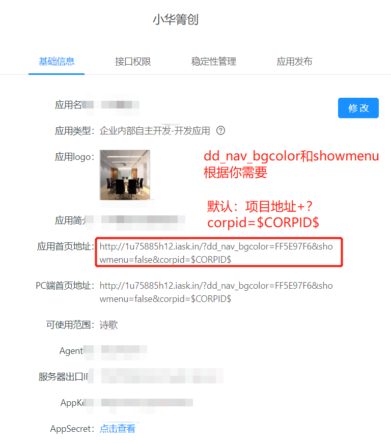
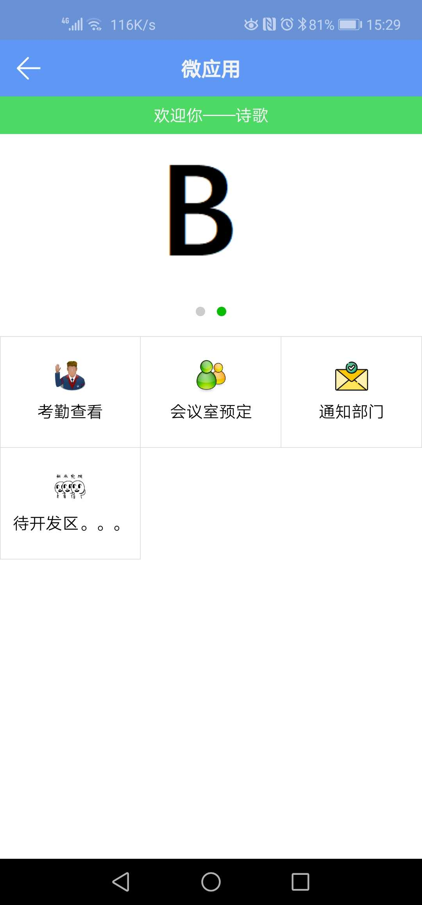

# DingdingDev
钉钉企业内部微应用免登

# 钉钉企业内部微应用开发
## 钉钉企业内部微应用开发 集成SpringBoot 便捷开发(前后端)

### 涵盖：
1. 钉钉企业内部微应用免登   **具体请看 UserController 相关**
2. 获取用户信息，钉钉里面手机号可作为唯一标识，绑定不同的系统。**具体请看 DingUserServiceImpl 类实现**
3. Springboot Controll 和 html 通信，基于 thymeleaf。**具体请看 index.html 相关**
4. Springboot 简单get 实现，以及前端 ajax 调用。**具体请看 attendance.html 和 UserController 相关**

#### tips:
* 请修改 application.yml 更换 ding 相关配置
* 可以在本地映射出去（花生壳免费），并加入出口ip白名单。
* static新引入的资源文件，需要重启项目才能found;templates 里放html文件
* 需要导入bak 里面的dingding-sdk，关于钉钉后台的前端 和 后端接口 可以去官网查看。
* [第三方企业微应用可参考这个](https://www.cnblogs.com/applerosa/p/11509512.html)

##
### 环境搭建完，后面就是根据各自项目去开发后台和前台代码了
## 
### 本人非前端和后端工程师，也是开发任务中穿插的任务，所以写下demo 供非同行人员快速开发。
## 

## 学习交流
* EMAIL:980373417@qq.com
* QQ:980373417

